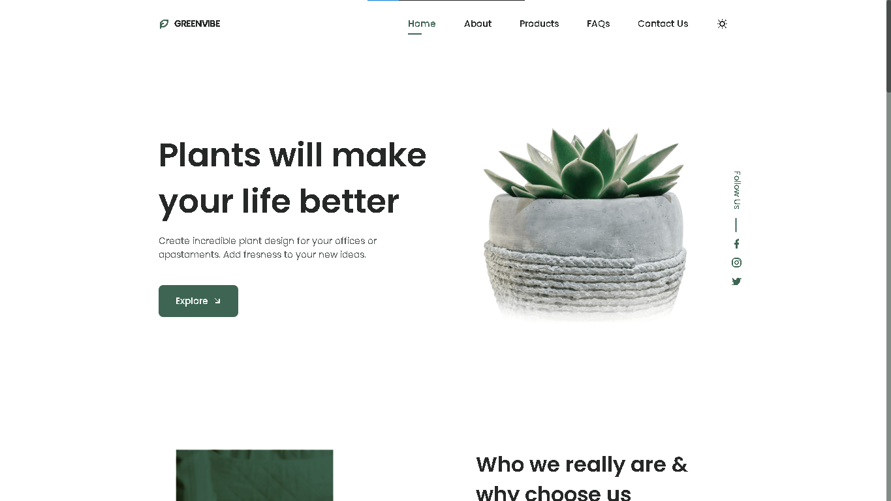
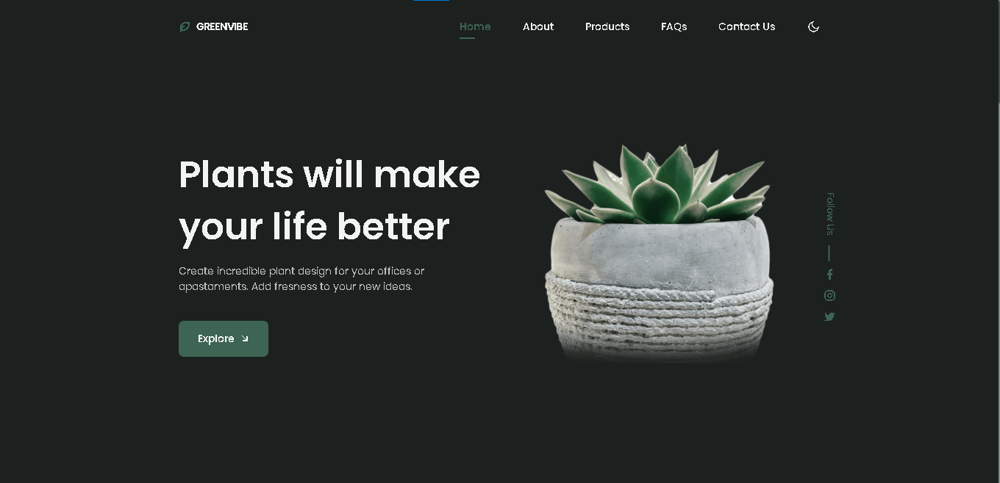
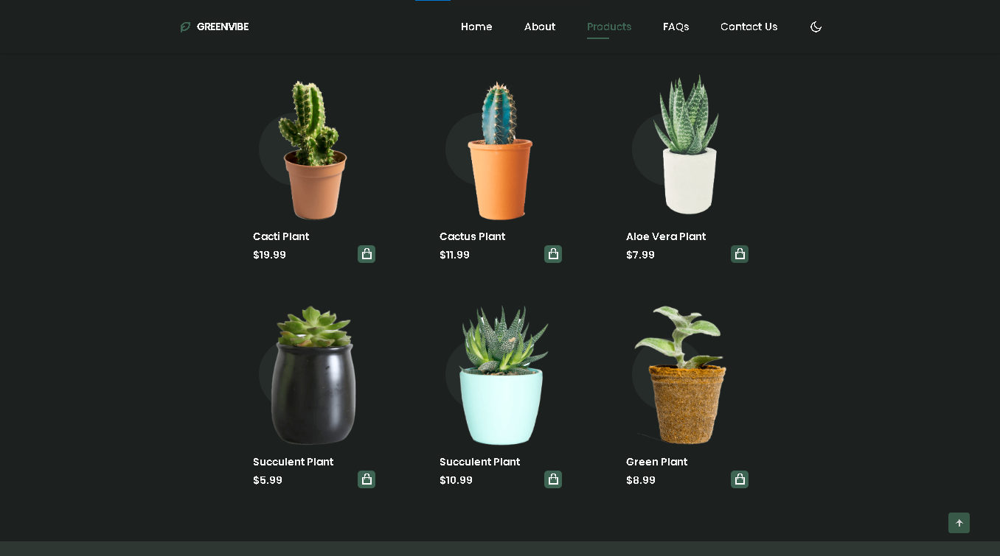

# 🌿 GreenVibe - Your Go-To Plant Store

 <!-- Replace the URL with your actual banner image link -->

## 📋 Description
GreenVibe is a website dedicated to selling plants, designed to provide an easy and attractive shopping experience for plant enthusiasts.  
The website is built using **HTML**, **CSS**, and **JavaScript** to deliver an engaging user interface and optimal performance.

---

## 🗼 Project Screenshots
### Homepage
 <!-- Replace the URL with your homepage screenshot -->

### Products Page
 <!-- Replace the URL with your products page screenshot -->

---

## 🚀 Features
- Elegant and eye-friendly design.
- Dynamic product display.
- Simple and user-friendly experience.
- Responsive design compatible with various devices.

---

## 🛠️ Technologies Used
- **HTML**: For the structure of the website.
- **CSS**: For styling and visual aesthetics.
- **JavaScript**: For interactivity and enhanced user experience.

---

## 📂 File Structure
```plaintext
GreenVibe/
│
├── index.html         # Main HTML file
├── css/
│   └── style.css      # CSS styles
├── js/
│   └── script.js      # JavaScript functionality
├── images/            # Folder for images
└── README.md          # This file
```

---

## ⚙️ How to Run the Project
1. Clone or download the repository:
   ```bash
   git clone https://github.com/username/GreenVibe.git
   ```
2. Open the `index.html` file in your favorite browser.

---

## ✨ Live Preview
You can visit the website here: [GreenVibe Live](https://lechehebdjaafar.github.io/GreenVibe/) <!-- Replace with your actual website link -->

---

## 🖌️ Future Enhancements
- Add a user login system.
- Enable online payment options.
- Provide advanced product filtering options.

---

## 💬 Contact Us
For more details or inquiries:
- 📱 Instagram: [@CodeCraftDL](https://instagram.com/ddos_attack_co)

---

> **Note:** This website was built using fundamental skills in HTML, CSS, and JavaScript as part of personal project development.
